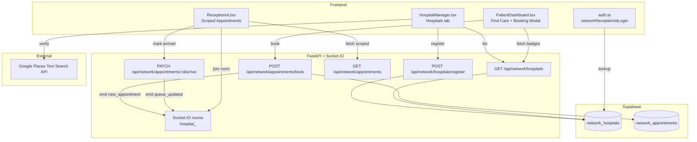

# Design Document: Multi-Hospital Network

## Overview

The Multi-Hospital Network feature extends Vela Health into a federated care network. A Hospital Manager registers external hospitals via Google Maps verification, assigns specializations, and generates scoped receptionist credentials. Patients discover Vela-registered hospitals in Find Care with a gold badge and can book appointments that instantly notify the correct hospital's receptionist over Socket.IO. Each network receptionist sees only their hospital's appointments.

The feature touches four existing files and adds new backend routes and two Supabase tables. No new frontend pages are strictly required — the network receptionist experience is handled by extending `Receptionist.tsx` with a login-time scope check.

---

## Architecture



### Key Design Decisions

1. **Google Places verification is frontend-only.** The `VITE_GOOGLE_MAPS_KEY` is already in `.env` and used by PatientDashboard. The Hospitals tab calls the Places Text Search REST endpoint directly from the browser, avoiding a backend proxy round-trip. The `place_id` returned is the canonical deduplication key stored in `network_hospitals`.

2. **Credential generation is backend-only.** The slug derivation and password generation happen in the FastAPI route, not the frontend, so the plaintext password is only ever transmitted once (in the registration response) and never stored in plain text in Supabase.

3. **Network receptionist login extends `receptionistLogin` in `auth.ts`.** Rather than a separate login path, the existing receptionist login form calls a new `networkReceptionistLogin` function that hits a backend lookup endpoint. On success it sets `vela_hospital_id` in localStorage alongside the existing `vela_role = "receptionist"` key. `Receptionist.tsx` reads this key at mount time to decide whether to use the scoped or general appointments endpoint.

4. **Socket.IO rooms per hospital.** The existing `sio` server already handles named rooms. Network receptionists join `hospital_<hospital_id>` on mount. The booking endpoint emits `new_appointment` to that room. This is additive — existing `queue_updated` events are also emitted to the same room when a network appointment is marked arrived.

5. **Vela badge cross-reference is a client-side join.** `PatientDashboard` fetches all `network_hospitals` once when the Find Care tab activates, builds a `Set<string>` of `place_id` values, and checks each Google Maps result against it. No per-hospital API call is needed.

---

## Components and Interfaces

### Frontend Components

#### HospitalManager.tsx — Hospitals Tab

New tab added to the existing tab bar alongside Performance, Ward Map, Personnel, AI Trends, System.

State additions:
```typescript
// Verification
hospitalNameInput: string
verifying: boolean
verifiedHospital: { name: string; address: string; place_id: string; lat: number; lng: number } | null
verifyError: string | null

// Specializations
specializations: string[]
specializationInput: string

// Registration
receptionistName: string
registering: boolean
registrationError: string | null
credentials: { email: string; password: string; hospital_name: string } | null

// Network list
networkHospitals: NetworkHospital[]
networkLoading: boolean
```

Sub-components (inline, not separate files):
- `VerifiedHospitalCard` — renders after successful Places lookup
- `SpecializationManager` — chip list with add/remove
- `CredentialCard` — shows email + password with copy buttons
- `NetworkHospitalList` — table of registered hospitals

#### PatientDashboard.tsx — Find Care additions

State additions:
```typescript
networkHospitals: NetworkHospital[]   // fetched once on tab activate
bookingNetworkHospitalId: string | null  // set when booking a Vela hospital
```

The existing `bookAppointment` function is forked: if `bookingNetworkHospitalId` is set, it POSTs to `/api/network/appointments/book` instead of `/api/appointments/book`.

#### Receptionist.tsx — Scoped mode

At mount, reads `localStorage.getItem("vela_hospital_id")`. If present:
- `fetchAppointments` calls `/api/network/appointments?hospital_id=<id>` 
- `handleMarkArrived` calls `PATCH /api/network/appointments/<id>/arrive`
- Socket joins room `hospital_<id>` and listens for `new_appointment`

No structural changes to the sidebar or other tabs.

#### auth.ts — networkReceptionistLogin

```typescript
export async function networkReceptionistLogin(email: string, password: string): Promise<boolean>
```

POSTs `{ email, password }` to `/api/network/auth/login`. On success, stores `vela_user`, `vela_auth`, `vela_role = "receptionist"`, and `vela_hospital_id`.

### Backend Routes (main.py additions)

```
POST   /api/network/hospitals/register
GET    /api/network/hospitals
POST   /api/network/auth/login
POST   /api/network/appointments/book
GET    /api/network/appointments
PATCH  /api/network/appointments/{id}/arrive
```

All routes are added to the existing `fastapi_app` instance in `main.py`.

---

## Data Models

### Supabase Table: `network_hospitals`

| Column | Type | Notes |
|---|---|---|
| `id` | `uuid` PK | auto-generated |
| `name` | `text` | canonical name from Google Places |
| `address` | `text` | formatted_address from Places |
| `place_id` | `text` UNIQUE | Google Places place_id — deduplication key |
| `lat` | `float8` | |
| `lng` | `float8` | |
| `specializations` | `text[]` | array of specialization strings |
| `receptionist_email` | `text` UNIQUE | `reception.<slug>@vela.health` |
| `receptionist_password_hash` | `text` | bcrypt hash |
| `receptionist_name` | `text` | display name |
| `created_at` | `timestamptz` | default `now()` |

### Supabase Table: `network_appointments`

| Column | Type | Notes |
|---|---|---|
| `id` | `uuid` PK | auto-generated |
| `hospital_id` | `uuid` FK → `network_hospitals.id` | |
| `patient_id` | `text` | patient's internal UUID |
| `patient_name` | `text` | denormalized for fast display |
| `vela_id` | `text` | patient's Vela ID (e.g. VLA-0001) |
| `date` | `date` | |
| `time` | `time` | |
| `status` | `text` | `pending` \| `arrived` \| `cancelled` |
| `created_at` | `timestamptz` | default `now()` |

### TypeScript Types

```typescript
interface NetworkHospital {
  id: string;
  name: string;
  address: string;
  place_id: string;
  lat: number;
  lng: number;
  specializations: string[];
  receptionist_email: string;
  receptionist_name: string;
  created_at: string;
}

interface NetworkAppointment {
  id: string;
  hospital_id: string;
  patient_id: string;
  patient_name: string;
  vela_id: string;
  date: string;
  time: string;
  status: 'pending' | 'arrived' | 'cancelled';
  created_at: string;
}
```

### Slug Derivation Algorithm

```python
import re, hashlib

def derive_slug(hospital_name: str) -> str:
    # lowercase, keep only alphanumeric and spaces, replace spaces with hyphens
    slug = re.sub(r'[^a-z0-9\s-]', '', hospital_name.lower())
    slug = re.sub(r'\s+', '-', slug.strip())
    slug = slug[:20].rstrip('-')
    return slug
```

If the derived slug already exists in `network_hospitals.receptionist_email`, a 4-digit suffix is appended (e.g. `reception.apollo-1234@vela.health`).

### Password Generation

```python
import secrets, string

def generate_password(length: int = 10) -> str:
    alphabet = string.ascii_letters + string.digits
    while True:
        pwd = ''.join(secrets.choice(alphabet) for _ in range(length))
        # Ensure at least one uppercase, one lowercase, one digit
        if (any(c.isupper() for c in pwd) and
            any(c.islower() for c in pwd) and
            any(c.isdigit() for c in pwd)):
            return pwd
```

---

## Correctness Properties

*A property is a characteristic or behavior that should hold true across all valid executions of a system — essentially, a formal statement about what the system should do. Properties serve as the bridge between human-readable specifications and machine-verifiable correctness guarantees.*

### Property 1: Slug format

*For any* hospital name string, the derived slug must contain only lowercase alphanumeric characters and hyphens, must not exceed 20 characters, and must not start or end with a hyphen.

**Validates: Requirements 4.2**

### Property 2: Password character class coverage

*For any* call to `generate_password()`, the result must be exactly 10 characters long and contain at least one uppercase letter, at least one lowercase letter, and at least one digit.

**Validates: Requirements 4.3**

### Property 3: place_id deduplication

*For any* `place_id` already present in `network_hospitals`, a second registration attempt with the same `place_id` must be rejected and the table must still contain exactly one record for that `place_id`.

**Validates: Requirements 4.5**

### Property 4: Vela badge and Book button cross-reference

*For any* list of hospital search results and any set of registered network hospitals, a hospital card renders the Vela badge and the "Book Appointment" button if and only if its `place_id` is present in the registered set — and renders neither if it is absent.

**Validates: Requirements 6.2, 6.4, 6.5**

### Property 5: Appointment booking round-trip

*For any* valid booking submission (patient_id, hospital_id, date, time), after a successful POST to `/api/network/appointments/book`, a GET to `/api/network/appointments?hospital_id=<hospital_id>` must return a record containing the same patient_id, date, and time with status `pending`.

**Validates: Requirements 7.2, 7.6, 8.1**

### Property 6: Scoped appointment isolation

*For any* two distinct hospitals A and B, appointments booked for hospital A must never appear in the response of `/api/network/appointments?hospital_id=<B_id>`, and vice versa.

**Validates: Requirements 5.2, 8.1**

### Property 7: Arrived status transition

*For any* appointment with status `pending`, after a PATCH to `/api/network/appointments/<id>/arrive`, the appointment's status must be `arrived` and must not revert to `pending` on any subsequent GET.

**Validates: Requirements 8.3**

### Property 8: Credential email format

*For any* registered hospital, the stored `receptionist_email` must match the pattern `reception.<slug>@vela.health` where `<slug>` satisfies the slug format constraints in Property 1.

**Validates: Requirements 4.2**

### Property 9: Socket.IO room targeting

*For any* hospital_id, both the `new_appointment` event (emitted on booking) and the `queue_updated` event (emitted on arrival) must be emitted exclusively to the room named `hospital_<hospital_id>` and not to any other room.

**Validates: Requirements 5.3, 7.3, 8.4**

### Property 10: Specialization chip round-trip

*For any* initial list of specialization chips, adding a new chip and then removing it must restore the list to its original state (same elements, same order).

**Validates: Requirements 3.2, 3.3**

### Property 11: Register button gating

*For any* UI state, the "Register Hospital" button must be enabled if and only if a verified hospital is present, the specializations list is non-empty, and the receptionist name field is non-empty.

**Validates: Requirements 3.4**

### Property 12: Hospital list rendering completeness

*For any* `network_hospital` record returned by the API, the rendered row in the Hospitals tab must contain the hospital name, address, all specializations, receptionist email, and registration date.

**Validates: Requirements 10.2**

---

## Error Handling

### Google Places Verification

- **No results**: Frontend displays inline error "Hospital not found on Google Maps. Please check the name and try again." Verify button re-enabled.
- **Network error / API key invalid**: Same inline error. The Places Text Search call is wrapped in try/catch; the error message is generic to avoid leaking API key status.
- **Loading state**: Button disabled, spinner shown for the duration of the fetch.

### Hospital Registration

- **Duplicate place_id**: Backend returns `{ "status": "error", "code": "DUPLICATE_PLACE_ID" }`. Frontend shows "This hospital is already registered on the Vela network."
- **Slug collision**: Backend appends a random 4-digit suffix and retries once. If still colliding (extremely unlikely), returns a 500 with a descriptive message.
- **Missing fields**: Frontend validates that `verifiedHospital !== null`, `specializations.length >= 1`, and `receptionistName.trim() !== ""` before enabling the Register button. Backend also validates and returns 422 if any field is missing.

### Network Receptionist Login

- **Wrong credentials**: Backend returns `{ "status": "error", "message": "Invalid credentials" }`. Frontend shows a toast error. No information about whether the email exists is leaked.
- **Non-network email on receptionist path**: `networkReceptionistLogin` is only called when the email matches `reception.*@vela.health`. The existing `receptionistLogin` handles `reception@vela.ai`.

### Appointment Booking

- **API failure**: Frontend shows toast "Booking failed. Please try again." (Requirement 7.5).
- **Missing date/time**: Frontend validates before submitting; the Book button is disabled until both fields are filled.

### Socket.IO Room Events

- **Room join failure**: Logged to console; the receptionist UI degrades gracefully (polling fallback via the existing 30-second interval in `Receptionist.tsx`).
- **Missed events**: The 30-second polling interval in `Receptionist.tsx` acts as a safety net for any dropped Socket.IO events.

---

## Testing Strategy

### Unit Tests

Focus on pure functions and specific examples:

- `derive_slug("Apollo Hospitals")` → `"apollo-hospitals"`
- `derive_slug("St. Mary's Hospital & Research Centre")` → slug ≤20 chars, no trailing hyphen (edge case)
- `derive_slug("")` → `""` (edge case: empty string)
- `generate_password()` returns a string of length 10
- Credential card "Copy Email" button writes correct value to clipboard (mock clipboard API)
- `networkReceptionistLogin` with wrong password returns `false` and does not set localStorage
- Booking modal "Book" button is disabled when date or time is empty
- Hospitals tab shows loading skeleton before fetch resolves (example)
- Empty `network_hospitals` response renders empty state message (example)
- Credential card dismiss button clears credentials and resets form (example)

### Property-Based Tests

Use **Hypothesis** (Python, for backend) and **fast-check** (TypeScript, for frontend logic).

Minimum 100 iterations per property test. Each test is tagged with the feature and property number.

**Backend (Hypothesis):**

```python
# Feature: multi-hospital-network, Property 1: Slug format
@given(st.text(min_size=1, max_size=200))
def test_slug_format(hospital_name):
    slug = derive_slug(hospital_name)
    assert len(slug) <= 20
    assert re.match(r'^[a-z0-9][a-z0-9-]*[a-z0-9]$|^[a-z0-9]$|^$', slug)
    assert not slug.startswith('-')
    assert not slug.endswith('-')

# Feature: multi-hospital-network, Property 2: Password character coverage
@given(st.integers(min_value=0, max_value=1000))
def test_password_coverage(_seed):
    pwd = generate_password()
    assert len(pwd) == 10
    assert any(c.isupper() for c in pwd)
    assert any(c.islower() for c in pwd)
    assert any(c.isdigit() for c in pwd)

# Feature: multi-hospital-network, Property 8: Email format
@given(st.text(min_size=1, max_size=200))
def test_credential_email_format(hospital_name):
    slug = derive_slug(hospital_name)
    if slug:
        email = f"reception.{slug}@vela.health"
        assert email.startswith("reception.")
        assert email.endswith("@vela.health")
```

**Integration / API tests (pytest + httpx):**

```python
# Feature: multi-hospital-network, Property 3: place_id deduplication
def test_duplicate_place_id(client, registered_hospital):
    res = client.post("/api/network/hospitals/register", json={**registered_hospital})
    assert res.status_code == 409
    assert res.json()["code"] == "DUPLICATE_PLACE_ID"

# Feature: multi-hospital-network, Property 5: Appointment booking round-trip
@given(st.fixed_dictionaries({
    "patient_id": st.uuids().map(str),
    "date": st.dates().map(str),
    "time": st.times().map(lambda t: t.strftime("%H:%M"))
}))
def test_booking_round_trip(client, hospital_id, booking):
    res = client.post("/api/network/appointments/book",
                      json={**booking, "hospital_id": hospital_id})
    assert res.status_code == 200
    list_res = client.get(f"/api/network/appointments?hospital_id={hospital_id}")
    records = list_res.json()["appointments"]
    match = next((r for r in records if r["patient_id"] == booking["patient_id"]), None)
    assert match is not None
    assert match["date"] == booking["date"]
    assert match["status"] == "pending"

# Feature: multi-hospital-network, Property 6: Scoped appointment isolation
def test_appointment_isolation(client, hospital_a_id, hospital_b_id):
    client.post("/api/network/appointments/book",
                json={"hospital_id": hospital_a_id, "patient_id": "p1",
                      "patient_name": "Test", "vela_id": "VLA-0001",
                      "date": "2025-01-01", "time": "10:00"})
    res = client.get(f"/api/network/appointments?hospital_id={hospital_b_id}")
    ids = [r["hospital_id"] for r in res.json()["appointments"]]
    assert hospital_a_id not in ids

# Feature: multi-hospital-network, Property 7: Arrived status transition
def test_arrived_transition(client, pending_appointment_id, hospital_id):
    client.patch(f"/api/network/appointments/{pending_appointment_id}/arrive")
    res = client.get(f"/api/network/appointments?hospital_id={hospital_id}")
    apt = next(r for r in res.json()["appointments"] if r["id"] == pending_appointment_id)
    assert apt["status"] == "arrived"
```

**Frontend (fast-check):**

```typescript
// Feature: multi-hospital-network, Property 4: Vela badge and Book button cross-reference
fc.assert(fc.property(
  fc.array(fc.record({ place_id: fc.string(), name: fc.string() })),
  fc.array(fc.record({ place_id: fc.string() })),
  (searchResults, networkHospitals) => {
    const registeredIds = new Set(networkHospitals.map(h => h.place_id));
    return searchResults.every(result => {
      const inNetwork = registeredIds.has(result.place_id);
      return computeHasBadge(result.place_id, registeredIds) === inNetwork &&
             computeHasBookButton(result.place_id, registeredIds) === inNetwork;
    });
  }
), { numRuns: 100 });

// Feature: multi-hospital-network, Property 1: Slug format (frontend mirror)
fc.assert(fc.property(
  fc.string({ minLength: 1, maxLength: 200 }),
  (name) => {
    const slug = deriveSlug(name);
    return slug.length <= 20 &&
      /^[a-z0-9][a-z0-9-]*[a-z0-9]$|^[a-z0-9]$|^$/.test(slug) &&
      !slug.startsWith('-') && !slug.endsWith('-');
  }
), { numRuns: 100 });

// Feature: multi-hospital-network, Property 10: Specialization chip round-trip
fc.assert(fc.property(
  fc.array(fc.string({ minLength: 1 })),
  fc.string({ minLength: 1 }),
  (initial, newChip) => {
    const after = addChip(initial, newChip);
    const restored = removeChip(after, newChip);
    return arraysEqual(initial, restored);
  }
), { numRuns: 100 });

// Feature: multi-hospital-network, Property 11: Register button gating
fc.assert(fc.property(
  fc.record({
    verifiedHospital: fc.option(fc.record({ name: fc.string(), place_id: fc.string() })),
    specializations: fc.array(fc.string({ minLength: 1 })),
    receptionistName: fc.string()
  }),
  ({ verifiedHospital, specializations, receptionistName }) => {
    const enabled = computeRegisterEnabled(verifiedHospital, specializations, receptionistName);
    const shouldBeEnabled = verifiedHospital !== null &&
      specializations.length >= 1 &&
      receptionistName.trim().length > 0;
    return enabled === shouldBeEnabled;
  }
), { numRuns: 100 });
```
